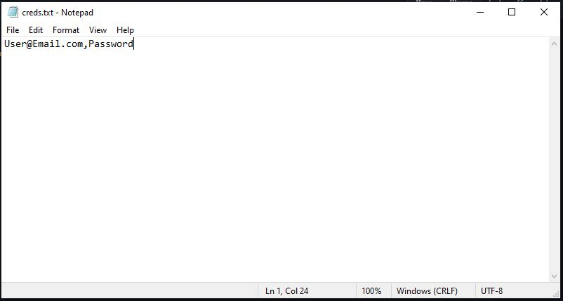

# rewards_points
A web automation program that does the max amount of searches for bing to get points for free stuff
## Setup
* Make sure you have Selenium installed using 'pip install selenium'
* Also make sure you have webdriver_manager with 'pip install webdriver_manager'
* Clone repo to your prefered directory
* Save a creds.txt file in the same directory with your email associated with your microsoft account and password seperated by a , WARNING DO NOT USE ANY SPACES
* 

* From your favorite command line bash terminal change to the directory
* Run with 'python3 run.py
## Future
* To add a Daily Set method
## Goal
* To add enough methods to make 8,500 points a month
